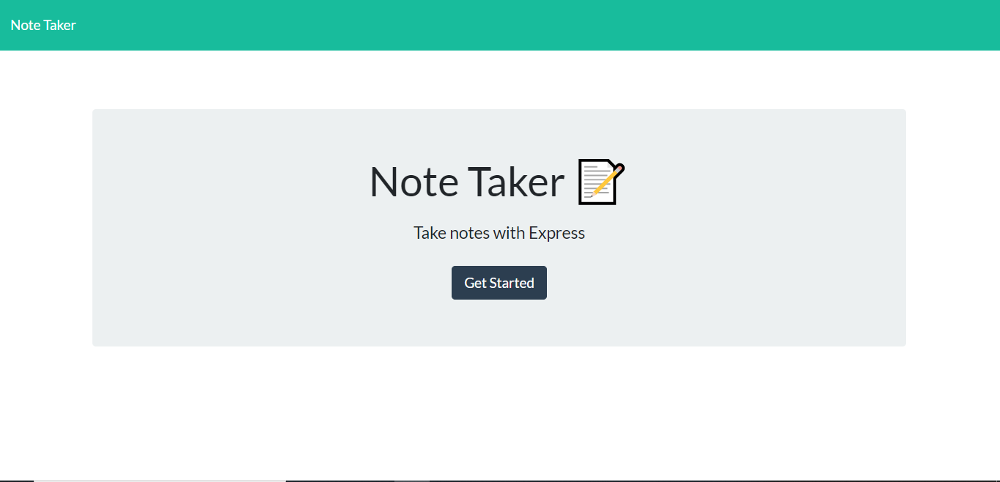
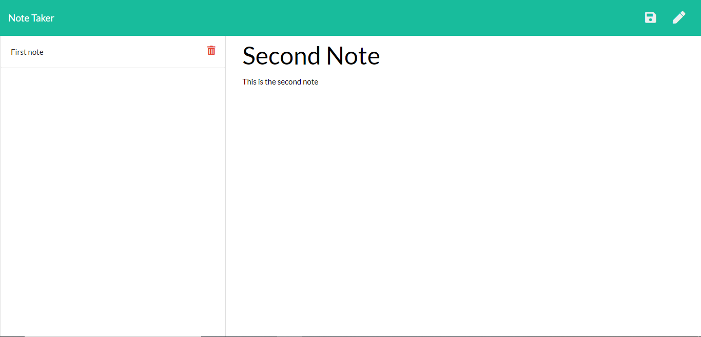

# Note-Taker

## Description: 
Tasked with producing a note taking application which would be able to take, store, and when complete, delete tasks we were able to produce a product which handled the server requirements layed out for us. We created a functioning server which stores and retrieves data required. We did so utilizing HTML, CSS, Javascript, node.js, and express.js. 
## Table of Contents

-[Description](#description)

-[Installation](#installation)

-[Instructions](#instructions)

-[Licenses](#licenses)

-[Deployed](#deployed)

-[Contact](#contact)

-[Contributors](#Contributors)

-[Testing](#Tests)

## Installation:
The app works as a standalone page. For coding the express, nodemon, path, and heroku npms were required.
## Instructions:
The application features a welcome or index page, as well as the note taking page itself. After navigating to the notes page, you can simply add a title and text, click the save icon, and after the task is completed, delete it.
### Licenses: 

### Deployed: 
[https://shrouded-beyond-55406.herokuapp.com/](https://shrouded-beyond-55406.herokuapp.com/)

### Contact:

[Github](https://github.com/boylepeter)

[LinkedIn](https://www.linkedin.com/in/peter-boyle-22b5071b7/)

Email: [Boyle.Peter614@gmail.com](Boyle.Peter614@gmail.com)

### Contributors: 
None

### Tests: 
Please feel free to try the app yourself, and let us know if you have any questions or comments via the contact section.
